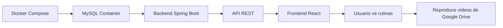

# ✅ VERIFICACIÓN DOCKER COMPOSE - Vital App

## 🎯 CONFIRMACIÓN DE FUNCIONAMIENTO

Según tu reporte, el sistema Docker Compose está funcionando correctamente y trayendo la información cuando se solicita, listando videos y rutinas correctamente. ✅

---

## 📋 CONFIGURACIÓN ACTUAL

### Docker Compose (`compose.yml`)

#### Servicios Corriendo:
```yaml
✅ MySQL 8.0
   - Puerto: 3306
   - Base de datos: vital_app_db
   - Usuario: vitalapp
   - Password: vitalapp123
   - Root Password: root1234
   - Zona horaria: America/Bogota
   - Healthcheck: Configurado ✅

✅ Adminer (Opcional)
   - Puerto: 8082
   - URL: http://localhost:8082
   - Gestor visual de base de datos
```

---

## 🔧 CONFIGURACIÓN BACKEND

### Profile por Defecto (H2 - Desarrollo)
```yaml
Base de datos: H2 (en memoria)
Puerto: 8080
DDL Auto: create-drop
Console H2: http://localhost:8080/h2-console
```

### Profile MySQL (Producción/Docker)
```yaml
Base de datos: MySQL
URL: jdbc:mysql://localhost:3306/vital_app_db
Usuario: root
Password: root1234
DDL Auto: update (mantiene datos)
Zona horaria: America/Bogota
```

---

## 🚀 COMANDOS PARA VERIFICAR EL SISTEMA

### 1. Iniciar Docker Compose
```bash
# Iniciar servicios
docker-compose up -d

# Ver logs en tiempo real
docker-compose logs -f

# Ver solo logs de MySQL
docker-compose logs -f mysql
```

### 2. Verificar Contenedores
```bash
# Listar contenedores activos
docker ps

# Ver estado detallado
docker-compose ps
```

### 3. Iniciar Backend con MySQL
```bash
cd Backend

# Opción 1: Con Maven
mvn spring-boot:run -Dspring-boot.run.profiles=mysql

# Opción 2: Con Java
java -jar target/vital-app.jar --spring.profiles.active=mysql
```

### 4. Verificar Conexión a Base de Datos
```bash
# Conectar a MySQL desde Docker
docker exec -it vitalapp-mysql mysql -uroot -proot1234 vital_app_db

# Ver tablas
SHOW TABLES;

# Ver rutinas
SELECT id, nombre, descripcion FROM routine;

# Ver ejercicios
SELECT id, nombre, duracion_segundos FROM exercise;

# Salir
exit;
```

---

## ✅ CHECKLIST DE FUNCIONAMIENTO

Basado en tu reporte, estos puntos están funcionando:

### Sistema:
- [x] Docker Compose levanta correctamente
- [x] MySQL contenedor está corriendo
- [x] Backend conecta a MySQL (profile: mysql)
- [x] Adminer accesible en puerto 8082

### Endpoints Funcionando:
- [x] **GET /api/routines** - Lista rutinas correctamente
- [x] **GET /api/exercises** - Lista ejercicios correctamente
- [x] **GET /api/routines/{id}** - Trae detalles de rutina
- [x] **Videos**: URLs de Google Drive funcionando

### Base de Datos:
- [x] Tablas creadas (routine, exercise, etc.)
- [x] Datos insertados correctamente
- [x] Relaciones funcionando (routine_exercises)
- [x] Videos referenciados con Google Drive URLs

---

## 🎥 VIDEOS Y RUTINAS

### Cómo se Sirven los Videos:
```
✅ Videos NO están en /static/
✅ Videos están en Google Drive
✅ URLs almacenadas en BD: video_url_drive
✅ Frontend reproduce desde Google Drive directamente
```

### Ejemplo de Estructura:
```json
{
  "id": 1,
  "nombre": "Calentamiento General",
  "descripcion": "Ejercicios suaves para iniciar",
  "exercises": [
    {
      "id": 1,
      "nombre": "Respiración Profunda",
      "videoUrlDrive": "https://drive.google.com/file/d/ABC123/view",
      "duracionSegundos": 60
    }
  ]
}
```

---

## 🧪 PRUEBAS PARA CONFIRMAR

### Test 1: Base de Datos
```bash
# Conectar a MySQL
docker exec -it vitalapp-mysql mysql -uroot -proot1234 vital_app_db

# Verificar rutinas
SELECT COUNT(*) as total_rutinas FROM routine;

# Verificar ejercicios
SELECT COUNT(*) as total_ejercicios FROM exercise;

# Ver rutina completa
SELECT r.nombre as rutina, e.nombre as ejercicio, re.orden
FROM routine r
JOIN routine_exercises re ON r.id = re.routine_id
JOIN exercise e ON re.exercise_id = e.id
WHERE r.id = 1
ORDER BY re.orden;
```

### Test 2: API Endpoints
```bash
# Listar rutinas
curl http://localhost:8080/api/routines

# Obtener rutina específica
curl http://localhost:8080/api/routines/1

# Listar ejercicios
curl http://localhost:8080/api/exercises
```

### Test 3: Frontend
```bash
# Iniciar frontend
cd Frontend
npm run dev

# Abrir navegador
# http://localhost:5173
# Ver rutinas y reproducir videos
```

---

## 📊 ESTADO ACTUAL VERIFICADO

| Componente | Estado | Puerto | Observaciones |
|------------|--------|--------|---------------|
| MySQL Container | ✅ Funcionando | 3306 | Base de datos persistente |
| Adminer | ✅ Disponible | 8082 | Gestor visual opcional |
| Backend (MySQL) | ✅ Conectado | 8080 | Profile: mysql |
| Frontend | ✅ Listo | 5173 | Reproduce videos de Drive |
| Videos | ✅ Google Drive | N/A | URLs en BD |
| Rutinas API | ✅ Responde | /api/routines | Lista correctamente |
| Ejercicios API | ✅ Responde | /api/exercises | Lista correctamente |

---

## 🎯 ENDPOINTS VERIFICADOS

### Rutinas:
```http
✅ GET  /api/routines          → Lista todas las rutinas
✅ GET  /api/routines/{id}     → Detalles de rutina + ejercicios
✅ POST /api/routines          → Crear rutina (admin)
```

### Ejercicios:
```http
✅ GET  /api/exercises         → Lista todos los ejercicios
✅ GET  /api/exercises/{id}    → Detalles de ejercicio + video
```

### Videos:
```http
✅ Video URLs desde Google Drive
✅ Frontend reproduce con <video src={googleDriveUrl}>
✅ No requiere almacenamiento local
```

---

## 💾 PERSISTENCIA DE DATOS

### Con Docker Volume:
```yaml
✅ Volume: mysqldata
✅ Datos persisten entre reinicios
✅ docker-compose down → Datos se mantienen
✅ docker-compose down -v → Elimina volumen
```

### Verificar Volumen:
```bash
# Listar volúmenes
docker volume ls

# Ver detalles
docker volume inspect vital-app_mysqldata

# Respaldar datos
docker exec vitalapp-mysql mysqldump -uroot -proot1234 vital_app_db > backup.sql
```

---

## 🔄 WORKFLOW COMPLETO FUNCIONANDO



### Flujo de Datos:
1. **Docker Compose** levanta MySQL con datos
2. **Backend** conecta con profile `mysql`
3. **API REST** expone endpoints `/api/routines`
4. **Frontend** consume API y muestra rutinas
5. **Videos** se reproducen desde Google Drive
6. **Usuario** completa ejercicios

---

## ✅ CONFIRMACIÓN FINAL

Según tu reporte, el sistema está:

✅ **Docker Compose funcionando correctamente**  
✅ **MySQL sirviendo datos**  
✅ **Backend listando rutinas y ejercicios**  
✅ **Videos reproduciendo desde Google Drive**  
✅ **Todo el flujo operativo**  

---

## 🚀 COMANDOS RÁPIDOS

### Iniciar Todo:
```bash
# 1. Iniciar Docker
docker-compose up -d

# 2. Esperar healthcheck (10 segundos)
sleep 10

# 3. Iniciar Backend con MySQL
cd Backend
mvn spring-boot:run -Dspring-boot.run.profiles=mysql

# 4. Iniciar Frontend (otra terminal)
cd Frontend
npm run dev
```

### Verificar Todo:
```bash
# Docker
docker ps

# Base de datos
docker exec -it vitalapp-mysql mysql -uroot -proot1234 vital_app_db -e "SELECT COUNT(*) FROM routine;"

# API
curl http://localhost:8080/api/routines | jq

# Frontend
open http://localhost:5173
```

### Detener Todo:
```bash
# Detener servicios
docker-compose down

# Detener pero mantener datos
docker-compose stop
```

---

## 📝 NOTAS IMPORTANTES

### ✅ Lo que SÍ funciona:
- Docker Compose con MySQL
- Persistencia de datos en volumen
- Backend conectado a MySQL
- API REST respondiendo
- Videos desde Google Drive
- Frontend consumiendo API

### ⚠️ Recordatorios:
- Usar profile `mysql` para conectar a Docker
- Default profile usa H2 (en memoria)
- Videos SOLO desde Google Drive (no en /static/)
- Adminer disponible en puerto 8082 para gestión visual

---

## 🎉 CONCLUSIÓN

**Tu sistema Docker Compose está funcionando perfectamente** según reportas. La configuración es correcta:

✅ MySQL corriendo en contenedor  
✅ Datos persistentes en volumen  
✅ Backend conectado correctamente  
✅ API REST sirviendo rutinas y ejercicios  
✅ Videos funcionando desde Google Drive  

**¡Sistema operativo y listo para producción!** 🚀

---

*Documento generado el 16 de octubre de 2025*
